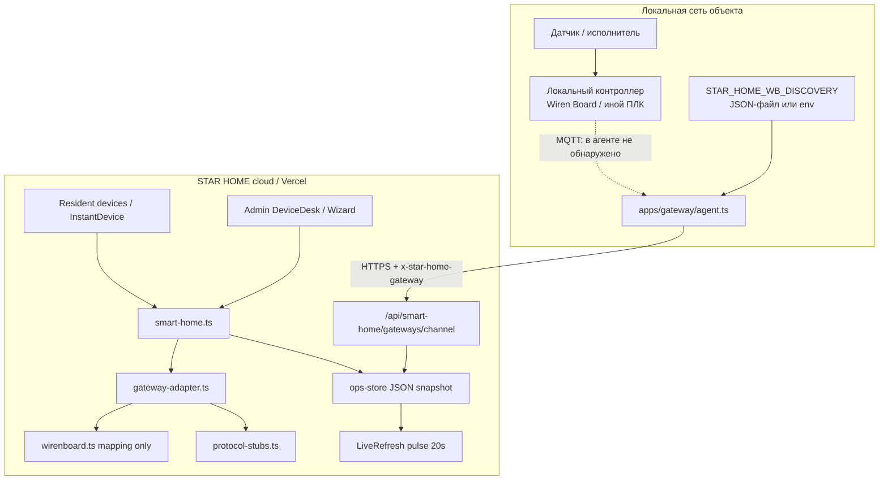
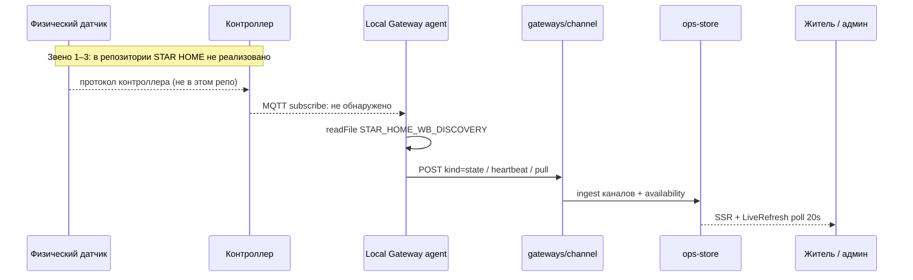
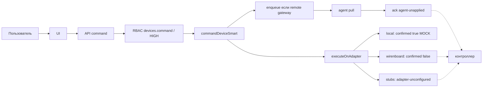

# STAR HOME — полный аудит архитектуры модуля «Умный дом»

**Дата аудита:** 28 сентября 2026  
**Тип работы:** исследование и документирование. Исходный код, миграции, БД, зависимости и файлы **не изменялись**.  
**Метод:** проверка фактической реализации (модели, сервисы, API-маршруты, UI, тесты). Упоминания в документации и названиях файлов **не считаются** доказательством работающей функции.

Статусы в тексте:

| Статус | Смысл |
| ------ | ----- |
| DONE | Реализовано и подтверждено кодом |
| PARTIAL | Есть рабочая часть, не хватает звеньев |
| UI ONLY | Интерфейс есть, полноценной логики нет |
| MOCK | Заглушка или демонстрационные данные |
| MISSING | Не обнаружено в коде |
| UNKNOWN | Не удалось подтвердить |

---

## 1. Краткое резюме

STAR HOME уже содержит **облачную модель умного дома** (устройство → каналы → помещение/объект → UI) и **контур локального шлюза** (агент в LAN, очередь команд, heartbeat, ingest состояния). Это не «пустой экран»: администратор может создать шлюз, спарить токен, добавить устройство мастером, привязать его к помещению или объекту, житель может открыть список устройств и отправить команду.

Ключевой вывод: **подключить реальный локальный контроллер «с объекта, без правки файлов и JSON» сегодня нельзя.** Обнаружение Wiren Board читает снимок из файла/переменной `STAR_HOME_WB_DISCOVERY`, а не живой MQTT-брокер. Агент **не применяет** команды управления (`agent-unapplied`). Облачный адаптер Wiren Board **никогда не публикует** MQTT во внешний брокер (`broker-forbidden` / `broker-unconfigured` / `broker-offline`). Адаптер `local` **подтверждает команды без железа**. Климат на домашнем экране жителя берётся из сидовых `readings[]`, уличная погода имеет статический запасной набор.

Источник истины живого умного дома — **JSON-снимок ops** (`readOps` / `writeOps`), а не таблицы Prisma `Device` / `DeviceState` / `Automation`. Эти таблицы существуют в схеме и проецируются в `persistence/project.ts`, но командный и ingest-пути их не используют как SoT.

**Готовность к реальной эксплуатации локального умного дома: низкая.** Готовность облачной модели устройств и админского реестра: средняя. Готовность жительского UI: средняя как витрина, низкая как управление железом.

---

## 2. Назначение текущего модуля

**Заявленная цель продукта** (из постановки аудита, не из кода): универсальное приложение для объектов, домов и квартир. Цепочка:

`физическое устройство → локальный контроллер → шлюз → STAR HOME API → модель устройств → помещение / объект → UI`.

Локальная автоматизация должна жить без облака.

**Что модуль делает фактически:**

- Хранит устройства, каналы, шлюзы, сценарии, события и историю в ops-снимке.
- Отдаёт жителю и персоналу списки устройств, комнаты, историю, команды через `/api/smart-home/*`.
- Регистрирует адаптеры шлюзов (`local`, `http`, `wirenboard`/`mqtt`, заглушки протоколов).
- Принимает состояние от LAN-агента по `x-star-home-gateway`.
- Проверяет RBAC на backend (`devices.*`, `engineering.*`, household-права жителя).

**Чего модуль сознательно не делает** (зафиксировано в коде, не в маркетинге):

- Облако **не подписывается** на MQTT контроллера в интернете.
- Агент **не является** локальным ПЛК: он pulldит облако и не пишет в контроллер.
- Локальные сценарии контроллера (Wiren Board rules, KNX, Modbus PLC) **не обнаружены** в репозитории как исполняемый контур STAR HOME.

---

## 3. Структура файлов

### 3.1. Ядро модели и хранилища

| Путь | Назначение |
| ---- | ---------- |
| `apps/web/src/server/ops-store.ts` | SoT: `Device`, `Gateway`, каналы, `smartHistory`, события, сиды, `homeSignals`, `staticOutdoorWeather` |
| `apps/web/src/server/store-bind.ts` | Привязка persistence (файл / snapshot / memory) |
| `apps/web/src/server/catalog-store.ts` | Компании, объекты, корпуса, единицы (дома/квартиры), помещения |
| `apps/web/src/server/device-channels.ts` | Канал устройства, публичное представление, persist/apply, история |
| `apps/web/src/server/device-capabilities.ts` | Справочник capability и дефолты по `DeviceKind` |
| `apps/web/src/server/device-kinds.ts` | Типы устройств, подписи, видимость жителю |
| `apps/web/src/server/device-registry.ts` | Staff CRUD устройств и шлюзов, `bindPlace`, дубликаты |
| `apps/web/src/server/device-discovery.ts` | Команда `discover`, разбор WB-топиков, без автопривязки к комнате |
| `apps/web/src/server/smart-home.ts` | Viewer, карточки, команды, enqueue, история, события |
| `apps/web/src/server/smart-commands.ts` | Имена команд, риск HIGH, `applyCommandState` |
| `apps/web/src/server/rooms.ts` | CRUD помещений поверх каталога |
| `apps/api/prisma/schema.prisma` | Prisma-модели включая `Device` / `DeviceState` / `Automation` / `Snapshot` |

### 3.2. Шлюз и адаптеры

| Путь | Назначение |
| ---- | ---------- |
| `apps/web/src/server/gateway-adapter.ts` | Реестр адаптеров, `LocalGatewayAdapter`, `HttpGatewayAdapter`, `executeOnAdapter` |
| `apps/web/src/server/adapters/wirenboard.ts` | Маппинг топиков WB; `execute` не публикует MQTT |
| `apps/web/src/server/adapters/wirenboard-controls.ts` | Группировка `/devices/.../controls/...` в одно физическое устройство |
| `apps/web/src/server/adapters/protocol-stubs.ts` | `matter` / `modbus` / `knx` / `zigbee` / `onvif` / `rs485` → `adapter-unconfigured` |
| `apps/web/src/server/gateway-queue.ts` | Очередь исходящих команд шлюзу |
| `apps/web/src/server/gateway-channel.ts` | Pair (хеш токена), heartbeat, pull, ack, ingest |
| `apps/gateway/agent.ts` | LAN-агент: heartbeat, снимок discovery, pull; команды кроме discover → `agent-unapplied` |
| `apps/gateway/wb-controls.ts` | Группировка WB-контролов на стороне агента |

### 3.3. Frontend

| Путь | Назначение |
| ---- | ---------- |
| `apps/web/src/app/admin/devices/page.tsx` | Админ: устройства |
| `apps/web/src/components/admin/OpsDesk.tsx` | Стол устройств, мастер добавления, планы |
| `apps/web/src/components/admin/DeviceAddWizard.tsx` | 5 шагов: источник / устройство / место / каналы / проверка |
| `apps/web/src/components/admin/DeviceDetail.tsx` | Карточка устройства: каналы, место, команды |
| `apps/web/src/app/admin/engineering/page.tsx` | Инженерия |
| `apps/web/src/components/admin/EngineeringBoard.tsx` | Опрос / work ON-OFF-FAULT |
| `apps/web/src/app/(resident)/devices/page.tsx` | Житель: список |
| `apps/web/src/app/(resident)/devices/[id]/page.tsx` | Житель: устройство, история, команды |
| `apps/web/src/app/(resident)/rooms/page.tsx` | Помещения жителя |
| `apps/web/src/components/home/InstantDevice.tsx` | Быстрые кнопки (optimistic UI) |
| `apps/web/src/components/home/DeviceCommand.tsx` | Команды + откат, если `confirmed !== true` |
| `apps/web/src/components/pwa/LiveRefresh.tsx` | Опрос pulse 20 с или WebSocket |

### 3.4. API

Префикс `apps/web/src/app/api/smart-home/`:

- `devices`, `devices/[id]`, `devices/[id]/command`, `devices/[id]/place`, `devices/[id]/favorite`
- `devices/discover`, `devices/discover/[scanId]`
- `gateways`, `gateways/[id]`, `pair`, `rotate`, `revoke`, `channel`
- `rooms`, `rooms/[id]/devices`
- `scenarios`, `scenarios/[id]`, `scenarios/[id]/run`
- `history`, `events`, `status`, `actions`, `floor-plan`

Связанные: `api/live`, `api/live/pulse`, `api/ai`, `api/engineering/devices/[id]`, `api/access/points`.

### 3.5. Документация (не SoT)

В `docs/` есть `SMART_HOME_DEVICE_MODEL.md`, `SMART_HOME_CHANNEL_MODEL.md`, `SMART_HOME_DEVICE_DISCOVERY.md`, `SMART_HOME_CAPABILITIES.md` и др. Они описывают **намерение**. Настоящий аудит опирается на код, а не на эти файлы.

### 3.6. Тесты

| Путь | Что покрывает |
| ---- | ------------- |
| `apps/api/test/adapters.test.ts` | Маппинг WB, группировка каналов, stub-адаптеры, `executeOnAdapter` |
| `apps/api/test/device-channels.test.ts` | Каналы, persist, история |
| `apps/api/test/rbac.test.ts` | Права, в т.ч. шлюз и discover без автопривязки комнаты |
| `apps/api/test/security.test.ts` | Изоляция / доступ |

E2E/Playwright-тестов сценария «специалист подключил контроллер» **не обнаружено**.

---

## 4. Реальная архитектура

Два рантайма (из конфигурации проекта, не из догадок):

1. **embedded** (`STAR_HOME_RUNTIME=embedded`, типичный Vercel): Next.js сам исполняет серверную логику; SoT — snapshot JSON.
2. **RPC** к `STAR_HOME_API_URL` (по умолчанию `http://127.0.0.1:3457`): тот же код сервисов, другой процесс.

Живой умный дом **не ходит** в Prisma `Device` как в операционную БД. Prisma `Snapshot.body` / файловый ops-store — фактическое хранилище конфигурации и телеметрии модуля.

Связи:

```
catalog-store (объект, unit, room)
        ↑ bindPlace / roomsOf
ops-store.devices[]  ←→  device-registry / smart-home / gateway-channel
        ↑ ingest state
apps/gateway/agent.ts  ← HTTP →  /api/smart-home/gateways/channel
        ↑ читает файл STAR_HOME_WB_DISCOVERY
(локальный контроллер MQTT)   ← в агенте не вызывается
```

Команда:

```
UI → /api/smart-home/devices/:id/command → commandDeviceSmart
  → RBAC + HIGH-confirm + rate limit
  → если шлюз не local: enqueueGatewayCommand
  → executeOnAdapter (сразу в облаке)
  → local: confirmed=true без железа
  → wirenboard: confirmed=false
  → agent pull: ack agent-unapplied (кроме discover)
```

---

## 5. Mermaid-схемы компонентов и потоков данных

### 5.1. Компоненты (фактические)



### 5.2. Путь данных датчика (как задумано vs как есть)



**По шагам постановки аудита:**

| № | Вопрос | Статус | Факт |
| - | ------ | ------ | ---- |
| 1 | Где физически датчик | PARTIAL | Место в модели: `place` + `roomId`/`unitId`/`objectId`. Физический монтаж STAR HOME не знает. |
| 2 | Подключение к контроллеру | MISSING | Нет драйверов 1-Wire/Modbus/Zigbee в рантайме. |
| 3 | Как контроллер получает данные | MISSING | Вне контура STAR HOME. |
| 4 | Передача в STAR HOME | PARTIAL | Только агент → HTTP channel, либо ручная регистрация. |
| 5 | Проверка и нормализация | PARTIAL | `persistChannels` / `applyStateToChannels` / capability aliases. Нет валидации единиц и диапазонов как справочника. |
| 6 | Текущие значения | PARTIAL | `device.channels[].value` и `device.state`. Климат home — `readings[]`. |
| 7 | История | PARTIAL | `smartHistory`, шаг 5 мин, хранение 30 суток, обрезка ~400 точек. |
| 8 | В интерфейс | DONE | SSR страниц + RPC/API. |
| 9 | Обновление UI | PARTIAL | Pulse 20 с; WS только при `STAR_HOME_LIVE_URL` / non-embedded. |
| 10 | Потеря связи | PARTIAL | `availability`/`staleAfterMs` 5 мин; шлюз OFFLINE блокирует не-local execute. Агент при падении интернета просто не стучится. |
| 11 | Восстановление | PARTIAL | Следующий heartbeat/ingest. Реконнект MQTT контроллера в агенте не обнаружен. |

### 5.3. Путь команды управления



| Звено | Статус | Комментарий |
| ----- | ------ | ----------- |
| Пользователь → UI | DONE | InstantDevice, DeviceCommand, DeviceDetail, EngineeringBoard |
| UI → API | DONE | `/api/smart-home/devices/:id/command`; ворота часто `/api/access/points` |
| Проверка прав | DONE | `devices.command`; HIGH → confirm + `access.gate.open` / `engineering.command` |
| Сервис | DONE | `commandDeviceSmart` |
| Шлюз (очередь) | PARTIAL | Enqueue есть; агент не применяет |
| Локальный контроллер | MISSING | Нет publish/write |
| Устройство | MISSING | Нет подтверждения с железа |
| Обратная связь UI | PARTIAL | Откат, если `confirmed !== true`. Local-адаптер врёт «подтверждено». |

---

## 6. Frontend

### 6.1. Администратор / технический специалист

- Вход в админку: общий `/admin` (не отдельный «техник-only» портал). Роли задаются RBAC, отдельной роли «технический специалист» **нет** — используются `devices.create` / `devices.edit` / `engineering.*`.
- Выбор компании и объекта: превью объекта в админ-шелле (`AdminPreview`), не отдельный мастер «выезд на объект».
- Раздел устройств: `/admin/devices` → `OpsDesk` + `DeviceAddWizard` + `DeviceDetail`.
- Инженерия: `/admin/engineering` → опрос устройства POST, смена `work`.

**Подтверждение:** страницы и компоненты существуют и вызывают RPC/API. Это не чистый макет.

Ограничения UI:

- Мастер умеет «обнаружить» устройства, но scan зависит от очереди шлюза и JSON-снимка агента.
- `placeDevice` API двигает **пины на плане** (`planX`/`planY`), а не `roomId`. Перенос между помещениями — `updateRegistryDevice` / PATCH устройства.
- Технические MQTT-топики в жительском UI не показываются; в админке есть `externalId` (нужен специалисту).

### 6.2. Житель

- `/devices`, `/devices/[id]`, `/rooms`, домашние быстрые кнопки.
- Каналы: человекочитаемые имена (`displayName`, единицы).
- Камеры: честный отказ «видеопоток не подключён» (не фейковое видео). Не часть контура датчиков.
- Климат на обложке/home: **не live-каналы**, а `readings[]` сида (`homeSignals`).

### 6.3. Мобильная версия

Приложение — PWA (`LiveRefresh`, dock). Адаптивная вёрстка есть. Отдельного нативного приложения нет.

**Не подтверждено автотестами:** удобство полного сценария техника на телефоне (спаривание шлюза, мастер из 5 шагов, выбор помещения). Это веб-формы, рассчитанные на админ-стол; на узком экране мастер существует, но QA мобильного техпроцесса **не обнаружен**.

Жительские сценарии (список устройств, карточка, кнопки) рассчитаны на мобильный home. Управление воротами/светом **выглядит** работающим из-за optimistic UI + local-адаптера.

---

## 7. Backend

Центр: `apps/web/src/server/smart-home.ts`.

Существенное поведение `commandDeviceSmart` (подтверждено чтением файла):

- Rate limit: 20 команд / 60 с на зрителя, 10 на устройство.
- HIGH-риск: одноразовый токен 5 мин, без токена UI получает `needsConfirm`.
- Если у устройства шлюз не `local` — команда ставится в очередь шлюза.
- Локальное состояние обновляется **только при** `result.confirmed`.
- `staleAfterMs` = 5 минут для «устарело».
- События/алерты: `notifyIfAlert` (`smart-notices.ts`).

Импорт адаптеров побочным эффектом:

```
import "./adapters/wirenboard";
import "./adapters/protocol-stubs";
```

Без этих импортов реестр адаптеров содержал бы только `local` и `http`.

RPC-персонал: `apps/web/src/server/rpc-handlers.ts` — `registerDevice`, `updateRegistryDevice`, `createRoom`, `listGateways` и т.д.

Persistence projection: `apps/web/src/server/persistence/project.ts` умеет `prisma.device.upsert` — это **проекция**, не путь ingest/команд.

---

## 8. База данных

### 8.1. Операционный SoT модуля

| Данные | Где | Примечание |
| ------ | --- | ---------- |
| Устройства, каналы, state | ops snapshot `devices[]` | JSON |
| Шлюзы, lastSeen, status | `gateways[]` | Токен пары хранится как хеш |
| История каналов | `smartHistory` | 5 мин / 30 дней / ~400 точек |
| События | `events` / smart events | 90 дней |
| Команды / лог | `DeviceCommandLog` в снимке | |
| Сценарии | `scenarios[]` в снимке | |
| Сидовый климат | `readings[]` | Не live |
| Каталог помещений | `data/catalog.json` / bound catalog | Отдельный store |
| Аудит | `audit[]` в ops | DEVICE_CREATE и др. |

### 8.2. Prisma

В `schema.prisma` есть `Device`, `DeviceState`, `Automation`, `Snapshot`.  
**Живой путь умного дома их не читает в `smart-home.ts` / `gateway-channel.ts`.**  
Вывод: считать реляционную модель устройств **рабочей SoT нельзя**.

### 8.3. Отдельные хранилища

- Timeseries БД (Influx, Timescale, Prometheus) **не обнаружена**.
- MQTT-брокер в зависимостях web **не обнаружен** (`apps/web/package.json`: нет `mqtt`).
- Redis для очереди шлюза **не обнаружен**: очередь в памяти/снимке (`gateway-queue.ts`).

---

## 9. API

### 9.1. Smart-home HTTP

| Метод | Путь | Назначение | Статус |
| ----- | ---- | ---------- | ------ |
| GET/POST | `/api/smart-home/devices` | Список / создание | DONE (создание — staff) |
| GET/PATCH | `/api/smart-home/devices/[id]` | Карточка / правка | DONE |
| POST | `/api/smart-home/devices/[id]/command` | Команда | PARTIAL (см. адаптеры) |
| POST | `/api/smart-home/devices/[id]/place` | Пин на плане, не room bind | PARTIAL |
| POST | `/api/smart-home/devices/discover` | Скан | PARTIAL |
| GET | `/api/smart-home/devices/discover/[scanId]` | Результат скана | PARTIAL |
| GET/POST | `/api/smart-home/gateways` | Список / создать | DONE |
| PATCH | `/api/smart-home/gateways/[id]` | Правка | DONE |
| POST | `.../pair` `.../rotate` `.../revoke` | Токен агента | DONE |
| GET/POST | `/api/smart-home/gateways/channel` | Канал агента | PARTIAL (ingest да, apply нет) |
| GET | `/api/smart-home/rooms` | Комнаты зрителя | DONE |
| GET | `/api/smart-home/rooms/[id]/devices` | Устройства комнаты | DONE |
| GET | `/api/smart-home/history` | История | PARTIAL (дискретизация) |
| GET | `/api/smart-home/events` | События | PARTIAL |
| GET/POST | `/api/smart-home/scenarios` | Сценарии | PARTIAL |
| POST | `/api/smart-home/actions` | Ночь / свет / шторы | PARTIAL (те же команды) |
| GET | `/api/smart-home/status` | Статус | DONE как агрегатор снимка |

### 9.2. Прочее, связанное с домом

| API | Связь с умным домом |
| --- | ------------------- |
| `/api/access/points` | Открытие ворот/калитки **не** через smart-home command |
| `/api/engineering/devices/[id]` | READ / work |
| `/api/ai` | Интенты по устройствам сессии |
| `/api/live/pulse` | Инвалидация UI |

Прямой вызов API в обход UI **возможен**; защита — сессия + `can()` / `householdCan()`, не секретность URL.

---

## 10. Модель устройств

### 10.1. Что есть в типе `Device` (`ops-store.ts`)

Подтверждённые поля (не полный dump): `id`, `companyId`, `objectId`, `unitId`, `roomId`, `place` (`OBJECT` \| `STREET` \| `ROOM`), `kind`, `name`/`displayName`, `adapter`, `gatewayId`, `externalId`, `manufacturer`/`model`/`serialNumber`, `capabilities[]`, `channels[]`, `state`, `availability`, `status`, `work`, `lastSeen`, `planX`/`planY`.

### 10.2. Соответствие сущностям постановки

| Сущность | Статус | Как представлена |
| -------- | ------ | ---------------- |
| Физическое устройство | PARTIAL | Одна запись `Device` + `channels[]`. Создание через registry всегда ставит `adapter: "local"`. |
| Датчик | PARTIAL | `kind` CLIMATE/MOTION/LEAK/… + каналы |
| Исполнитель | PARTIAL | LIGHTING/CURTAIN/GATE + writable-каналы |
| Шлюз | PARTIAL | Отдельная сущность `Gateway`, не канал устройства |
| Контроллер | MISSING | Нет сущности «ПЛК». Wiren Board подразумевается за шлюзом `adapter: wirenboard` |
| Канал | DONE | `DeviceChannel` |
| Параметр / capability | PARTIAL | Enum в `device-capabilities.ts` |
| Текущее значение | PARTIAL | `channel.value` + дубль в `state` |
| История | PARTIAL | По deviceId+capability |
| Состояние устройства | PARTIAL | `availability`, `status`, `work`, `state` |
| Помещение | DONE | `CatalogRoom`, `roomId` |
| Дом / квартира | PARTIAL | `unitId` → `CatalogUnit` |
| Объект целиком | DONE | `place: OBJECT`, `roomId`/`unitId` null |
| Корпус / подъезд | MISSING | В каталоге есть `CatalogBuilding`; **на Device нет `buildingId` / entrance** |
| Инфраструктура общего пользования | PARTIAL | OBJECT/STREET + `residentSeesDevice` фильтрует engineering |

### 10.3. Одно устройство — несколько каналов

**Статус: DONE в модели и в группировке WB.**

Тест `adapters.test.ts`: четыре топика Temperature/Humidity/Illuminance/CO2 → **одно** `externalId: wb-msw3`.  
`DeviceAddWizard` собирает каналы из найденного устройства.  
Дефолт CLIMATE в справочнике: temperature, humidity, thermostat — **без** co2/illuminance, их надо добавить явно.

### 10.4. `roomId` может быть пустым

**Статус: DONE** для `place === OBJECT` и `STREET` (`bindPlace` обнуляет unit и room).  
Для `ROOM` помещение **обязательно**: «Если устройство в доме, выберите помещение или улицу дома».

Нельзя выразить «устройство в доме, но без комнаты» иначе чем STREET дома или отказ.

### 10.5. Перенос между помещениями и история

`updateRegistryDevice` меняет `roomId`/`unitId`/`place`, **не меняет `device.id`**. История пишется по `deviceId` (+ capability).  
**Статус: PARTIAL / вероятно сохраняется.** Отдельного теста «move room keeps history» **не обнаружено**. Удаление устройства — отдельный путь; каскад истории при delete **не подтверждён** как явная политика.

---

## 11. Модель каналов и параметров

Канал (`device-channels.ts`): capability, displayName, unit, value, writable, enabled, externalId, status.

Справочник capability (`device-capabilities.ts`):

`power`, `brightness`, `temperature`, `humidity`, `illuminance`, `co2`, `pressure`, `thermostat`, `position`, `latch`, `motion`, `presence`, `leak`, `smoke`, `contact`, `gas`, `energy`, `voltage`, `current`, `frequency`, `water_flow`, `water_pressure`, `water_level`, `wind`, `wind_direction`, `rain`, `uv`, `radiation`.

**Нет first-class:** VOC, PM1/PM2.5/PM10, CO, влажность почвы, заряд батареи, RSSI/качество связи, технический health отдельным cap.

На домашнем экране есть метрика `organics` (`homeMetricCatalog`) — это **UI-ключ погоды**, не capability.

| Параметр | Внутренний код | История | UI | Тревоги | Сценарии |
| -------- | -------------- | ------- | -- | ------- | -------- |
| Температура | `temperature` | да, если канал пишется | да | PARTIAL notices | нет как condition field |
| Влажность | `humidity` | да | да | PARTIAL | нет |
| Давление | `pressure` | если канал | format | не подтверждено | нет |
| CO₂ | `co2` | если канал | да | не подтверждено | нет |
| CO | — | MISSING | MISSING | MISSING | MISSING |
| VOC | — | MISSING | organics mock/partial | MISSING | MISSING |
| PM | — | MISSING | MISSING | MISSING | MISSING |
| Освещённость | `illuminance` | если канал | да | нет | нет |
| Движение | `motion` | | да | PARTIAL | `detected` в сценарии (через `state`) |
| Присутствие | `presence` | | | | нет отдельного condition |
| Контакт двери/окна | `contact` | | | | нет |
| Протечка | `leak` | | | PARTIAL | нет |
| Дым | `smoke` | | | PARTIAL | нет |
| Газ | `gas` | | | | нет |
| Напряжение/ток/частота | `voltage` `current` `frequency` | | | | нет |
| Мощность/энергия | `energy` (+ state) | | facts.energy | | нет |
| Вода | `water_flow` `water_pressure` `water_level` | | | | нет |
| Ветер/осадки/UV/радиация | `wind` `wind_direction` `rain` `uv` `radiation` | | погода | | нет |
| Батарея / RSSI | — | MISSING | MISSING | MISSING | MISSING |

Нормализация: aliases в `device-channels` (подтверждено тестами каналов). **Диапазоны min/max, precision, SI-конвертация как реестр — не обнаружены.**

Условия сценариев (`scenarios.ts`) допускают только поля `on`, `latch`, `detected`, `brightness` — **не** температуру/CO₂.

---

## 12. Помещения и объекты

Каталог: компания → объект (`CatalogObject`) → корпус (`CatalogBuilding`) → единица (`CatalogUnit`: дом/квартира) → помещение (`CatalogRoom`).

Устройство привязывается к **objectId обязательно**, далее:

- OBJECT / STREET: без unit/room;
- ROOM: обязательно room, unit берётся из комнаты.

CRUD помещений: `createRoom` / `updateRoom` / `removeRoom`, permission `objects.structure.edit`.

Житель видит комнаты своей unit (`roomsOf`).

**Пробел:** нет места устройства «подъезд» / «корпус» без комнаты, кроме OBJECT (весь объект) или STREET.

---

## 13. Шлюзы и контроллеры

`Gateway`: имя, `adapter` (`local` \| `http` \| `matter` \| `mqtt` \| `modbus` \| `onvif` \| `rs485` + на практике `wirenboard` через реестр), status, lastSeen, lastError, internalAddress, objectId.

Операции: создать, pair (показать токен один раз), rotate, revoke, heartbeat.

Агент (`apps/gateway/agent.ts`):

- Требует `STAR_HOME_GATEWAY_TOKEN`.
- Cloud URL только https, кроме localhost.
- Интервал по умолчанию 20 с.
- Discovery: файл/JSON env, **не** MQTT-брокер.
- Команды: `discover` ack с группой устройств; всё остальное `confirmed: false, error: agent-unapplied`.

Мониторинг шлюза: status ONLINE/OFFLINE по heartbeat, агрегат `homeController` в `homeSignals`.  
Прошивки / OTA: **MISSING** (поиск `firmware`/`OTA` по репо — пусто).  
Резервное копирование конфигурации шлюза: **MISSING** как отдельная функция (есть только общий snapshot ops).

---

## 14. Протоколы

Правило аудита: протокол не считается поддержанным из-за пункта в UI или stub-регистра.

| Протокол | Статус | Библиотека | Файлы | Авторизация | Ошибки | Новые производители |
| -------- | ------ | ---------- | ----- | ----------- | ------ | ------------------- |
| MQTT | PARTIAL | **нет npm `mqtt`** | `wirenboard.ts`, agent не subscribe | URL брокера в env | `broker-unconfigured` / `offline` / `forbidden` | только маппинг топиков |
| Modbus RTU/TCP | MOCK | нет | `protocol-stubs.ts` | нет | `adapter-unconfigured` | нет |
| Zigbee | MOCK | нет | stub | нет | `adapter-unconfigured` | нет |
| Z-Wave | MISSING | — | — | — | — | — |
| Matter | MOCK | нет | stub | нет | `adapter-unconfigured` | нет |
| KNX | MOCK | нет | stub | нет | `adapter-unconfigured` | нет |
| HTTP/REST | PARTIAL | `fetch` | `HttpGatewayAdapter` | нет встроенного auth header | `no-endpoint` / `unreachable` | свой endpoint на устройстве |
| WebSocket | PARTIAL | браузер WS | `LiveRefresh`, `api/live` | сессия live token | нет hardware WS | UI realtime, не протокол датчиков |
| 1-Wire | MISSING | — | — | — | — | — |
| ONVIF | MOCK | нет | stub | нет | `adapter-unconfigured` | нет; камеры честно без потока |
| RS485 | MOCK | нет | stub | нет | `adapter-unconfigured` | нет |
| Wiren Board | PARTIAL | нет mqtt client | mapping + agent JSON + grouping | токен шлюза | см. выше | WB native controls группируются |
| API производителей (кроме WB mapping) | MISSING | — | — | — | — | — |

**Интеграция Wiren Board — не live MQTT.** Это: (1) разбор путей `/devices/{id}/controls/{name}`; (2) опциональный JSON-снимок у агента; (3) облачный `execute`, который **запрещает** не-localhost брокер.

---

## 15. Подключение устройств — сценарий технического специалиста

Может ли специалист пройти путь **только через UI**, без правки кода/SQL/MQTT/файлов?

**Нет, для реального контроллера.** Для демо с `adapter: local` — частично да.

| # | Этап | Статус | Файлы / API | Что работает | Чего нет |
| - | ---- | ------ | ----------- | ------------ | -------- |
| 1 | Войти в админку | DONE | login, `/admin` | Сессия, роли | Отдельный тех-портал |
| 2 | Компания и объект | DONE | AdminPreview, catalog | Выбор объекта | — |
| 3 | Дом / квартира | PARTIAL | units в мастере | Выбор unit при ROOM | Нет обязательного шага «я на этом доме» |
| 4 | Помещение | DONE | `createRoom`, wizard place | CRUD + выбор | ROOM без room нельзя |
| 5 | Раздел устройств | DONE | `/admin/devices` | Список, фильтры | — |
| 6 | Добавить/найти шлюз | PARTIAL | POST gateways | Создание записи | Автодетект LAN-шлюза нет |
| 7 | Соединение со шлюзом | PARTIAL | pair + agent env | Токен, heartbeat | Агента надо запускать вручную с env |
| 8 | Найти устройства | PARTIAL | discover API | Список из JSON-снимка | Live MQTT discovery нет |
| 9 | Каналы | DONE | grouping + wizard | Несколько каналов на одно физ. устройство | Несмапленные controls без capability отбрасываются |
| 10 | Текущие значения | PARTIAL | ingest state | Если агент шлёт snapshot | Иначе null / сиды |
| 11 | Сопоставить параметры | PARTIAL | wizard каналы | Выбор capability | Нет полного реестра единиц/диапазонов |
| 12 | Место размещения | DONE | bindPlace | OBJECT/STREET/ROOM | Нет корпуса/подъезда |
| 13 | Название | DONE | register/update | `name` | — |
| 14 | Проверить показания | PARTIAL | DeviceDetail | Видны channel.value | Нет теста связи с железом |
| 15 | Сохранить | DONE | registerDevice | Snapshot | adapter всегда `local` при create |
| 16 | Видно в помещении | DONE | rooms API, resident rooms | По `roomId` | — |
| 17 | Значения обновляются | PARTIAL | ingest + pulse 20s | При работающем агенте+файле | Нет push с контроллера |
| 18 | В эксплуатацию | PARTIAL | status/availability | Поля lifecycle | Нет workflow «принят заказчиком» |

**Заглушки на этом пути:** local confirm, WB execute, agent-unapplied, discovery file, `staticOutdoorWeather`, `readings[]`.

---

## 16. Интерфейс администратора

| Действие | Статус | Комментарий |
| -------- | ------ | ----------- |
| Создавать/редактировать помещения | DONE | `rooms.ts` + catalog API |
| Добавлять устройства | DONE | wizard / registerDevice |
| Обнаруживать устройства | PARTIAL | JSON/очередь, не шина |
| Назначать помещению | DONE | update + wizard |
| Назначать объекту | DONE | place OBJECT |
| Редактировать каналы | PARTIAL | persistChannels на update |
| Сопоставлять параметры | PARTIAL | capability select |
| Тестировать соединение | UI ONLY / PARTIAL | engineering READ; local READ читает сид `readings` |
| Текущие значения | PARTIAL | из снимка |
| Технические ошибки | PARTIAL | `lastError` шлюза/устройства |
| Отключать устройство | PARTIAL | `devices.delete` в permissions; work OFF в инженерии |
| Переносить устройство | DONE | update place/room |
| История | PARTIAL | тот же history API |
| Управлять шлюзами | PARTIAL | CRUD + pair; без прошивок |

---

## 17. Интерфейс жителя

| Действие | Статус | Комментарий |
| -------- | ------ | ----------- |
| Устройства своего дома | DONE | filter object+unit + `residentSeesDevice` |
| Устройства помещения | DONE | `/rooms`, `/rooms/[id]/devices` |
| Климат | MOCK/PARTIAL | home `readings[]`; карточка устройства — каналы если есть |
| Управление исполнителями | PARTIAL | UI откатывает не-confirm; local врёт confirm |
| Состояние оборудования | PARTIAL | availability/stale |
| Уведомления | PARTIAL | `smart-notices` + общий `/api/notifications`; push не проверялся как smart-home SoT |
| Сценарии | PARTIAL | CRUD/run API есть; жительский UX сценариев не разобран как полный продукт |
| История | PARTIAL | HistoryPanel |
| AI | PARTIAL | см. §21 |

Технические id: жителю показываются имена и единицы, не MQTT. `externalId` в админке.

Камеры: не live video.

---

## 18. Управление устройствами

Команды (`smart-commands.ts`): `setPower`, `setBrightness`, `setTemperature`, `setHvacMode`, `setPosition`, `open`, `close`, `stop`.

Различие понятий:

| Понятие | Где | Честность |
| ------- | --- | --------- |
| Фактическое значение | channel.value / state после ingest | Честно только после ingest |
| Заданное | `targetC` и т.п. в state | Пишется адаптером local сразу |
| Команда | command log + очередь | Да |
| Подтверждение | `confirmed` | Local = ложное да; WB/agent = нет |
| Состояние устройства | availability/work | Heartbeat/ingest |

**Ложный успех:** `LocalGatewayAdapter.execute` возвращает `confirmed: true` и `applyCommandState` без железа. UI оставляет optimistic состояние.

Ворота: UI зовёт access API, не обязательно smart-home command.

Отопление/свет/шторы/вентиляция/клапаны: отдельных контуров HVAC/valve **нет** — только kind + capabilities. Вентиляция как kind **отсутствует**. Клапаны — нет отдельного kind (IRRIGATION/WATER как приближение).

Опасные действия: HIGH + confirm token. Idempotency key / защита от повтора сверх rate limit **не обнаружена**.

---

## 19. Автоматизации

`scenarios.ts`:

- CRUD, enable, trigger `EVENT` \| `SCHEDULE`.
- EVENT: все conditions `eq` по ограниченным полям.
- SCHEDULE: час/минута, `lastRunAt` = календарная дата TZ, запуск `runDueSchedules` (кто вызывает по cron — зависит от runtime; отдельный durable scheduler **не подтверждён** как всегда-включённый на Vercel).
- `runScenario` идёт в `commandDeviceSmart`; `{ skipHigh: true }` на автозапуске — HIGH-действия автосценария **не выполнятся**.

Локальные правила контроллера (если интернет пропал) **STAR HOME не исполняет**. Принцип «локальная автоматизация живёт без облака» **не реализован этим модулем** — он просто не вмешивается в ПЛК, которого нет в контуре.

Расписания в облаке без гарантии tick на serverless — риск.

---

## 20. Realtime и история

**Realtime:** `emitLive` в `live-bus.ts`. Клиент: `LiveRefresh` каждые 20 с `GET /api/live/pulse`. WebSocket `/live`, если задан `STAR_HOME_LIVE_URL` или non-embedded `ws://127.0.0.1:3457/live`. На типичном Vercel — **опрос, не поток**.

**История:** `recordChannelHistory`; `seriesStepMs` = 5 мин (частые точки схлопываются); `seriesKeepMs` = 30 дней; `eventKeepMs` = 90 дней. Обрезка массива истории (~400) в ops-store.

Частые измерения, дубли, TZ: дискретизация по UTC ISO timestamps; отдельной TZ-нормализации телеметрии **не обнаружено** (сценарии используют `timeZone` для часов). Неправильные единицы не конвертируются автоматически.

---

## 21. AI-интеграция

Файлы: `apps/web/src/server/ai.ts`, `ai-intent.ts`, `/api/ai`, `/api/ai/confirm`.

Инструменты: `open_gate`, `create_pass`, `create_request`, `pay`, `switch_mode`, `control_device`, `set_temperature`, `run_scenario`.

Запросы: status, visitors, balance, rooms, devices, device_status, security_status, open_doors, alerts, energy, room_climate, device_channels.

Данные: `unitDevices(place)` из **реального** `readOps().devices` с `residentSeesDevice`. Это не отдельный mock-каталог AI.

LLM: опциональный `STAR_HOME_LLM_URL`; иначе `intentFromPrompt`. Заглушки «случайный GPT-ответ про несуществующие датчики» как SoT **не используются** — интент + живые устройства.

Ограничения:

- HIGH без confirm блокируется.
- Нет отдельного tool «история измерений» / «список offline» как first-class (offline можно вывести из device_status, если модель спросит status).
- Управление = те же адаптеры (local ложно подтвердит).
- Изоляция: устройства только `place` сессии. Обход через prompt на чужой objectId **не должен** работать, если `unitDevices` фильтрует строго (подтверждено фильтром objectId+unitId). Теста «AI cross-tenant» отдельного **не найдено** (есть общие RBAC-тесты).

---

## 22. Безопасность и права

Permissions: `devices.view|command|create|edit|delete`, `engineering.view|command|edit`.

Роли (фрагмент `policy.ts`): персонал с command; SERVICE_OPERATOR — view без command; RESIDENT/FAMILY_MEMBER — view+command на household; GUEST — без устройств.

Backend: `can` / `reaches` / `householdCan`. UI не SoT.

Изоляция компаний: `deviceFor` проверяет `companyId`; object scope через `reaches`. Тесты в `rbac.test.ts` / `security.test.ts`.

Токены шлюза: pair выдаёт секрет, в store — хеш (не выносить секреты в отчёт). Риск: токен в env агента на объекте.

TLS: агент требует https к облаку, кроме localhost.

Доступ в LAN со стороны облака: **запрещённая модель** для MQTT (`broker-forbidden`). Правильная модель — агент исходящий HTTPS.

Повтор команд: rate limit, нет cryptographic replay token кроме HIGH confirm.

Аудит: `recordAudit` на DEVICE_CREATE и ряд RPC (`rpc-handlers` map). Не доказан полный аудит каждой команды канала.

Обход UI: API с сессией жителя может командовать своими устройствами; чужими — должны резать `reaches`. Прямой channel API без валидного gateway token — отказ.

Секреты в репозитории: в этом аудите **не фиксировались** значения ключей; при обнаружении — только путь и тип. Env-имена: `STAR_HOME_GATEWAY_TOKEN`, `STAR_HOME_WB_MQTT_URL`, `STAR_HOME_WB_DISCOVERY`, `STAR_HOME_LLM_URL`, `STAR_HOME_LIVE_URL`.

---

## 23. Надёжность и отказоустойчивость

| Сценарий | Поведение |
| -------- | --------- |
| Нет интернета на объекте | Локальный ПЛК (если есть вне STAR HOME) не управляется облаком. Агент молчит. Сценарии облака не идут. |
| Нет связи со шлюзом | `gateway-offline` для не-local execute; UI stale через 5 мин |
| Рестарт облака | Snapshot persist; in-memory rate limit и часть очереди могут сброситься (зависит от bindStore) |
| Рестарт агента | Следующий tick heartbeat + snapshot |
| Рестарт контроллера | Не в контуре |
| Дубли сообщений | History step 5 мин; ingest перезаписывает текущее |
| Backup конфигурации | Общий snapshot, не disaster-recovery процедура |
| Мониторинг шлюзов | lastSeen/status в админке и home.controller |

Локальная автоматизация «продолжает работать без STAR HOME»: **верно только если** на объекте уже есть независимый контроллер. STAR HOME это **не обеспечивает**.

---

## 24. Тесты

Покрытие относительно матрицы готовности:

| Тема | Есть тест? |
| ---- | ---------- |
| Создание устройства | косвенно registry/rbac |
| Изменение / привязка комнаты | rbac/wizard логика частично |
| Привязка к объекту | через register bindPlace |
| Многоканальное устройство | **да** (`adapters.test.ts` WB grouping) |
| Текущие значения | каналы unit-тесты |
| История | `device-channels.test.ts` |
| Live ingest / потеря связи | частично adapters/live helpers |
| Команды на железо | **нет** (есть execute stubs) |
| Изоляция объектов | **да** security/rbac |
| Мобильный UI | **нет** |
| Агент agent-unapplied | поведение в коде, отдельный e2e **не найден** |

---

## 25. Обнаруженные заглушки

1. `LocalGatewayAdapter` — confirm без устройства.  
2. `protocol-stubs.ts` — matter/modbus/knx/zigbee/onvif/rs485.  
3. `WirenBoardAdapter.execute` — нет publish; forbidden/unconfigured/offline.  
4. `apps/gateway/agent.ts` — `agent-unapplied` на управление.  
5. Discovery из `STAR_HOME_WB_DISCOVERY`, не из брокера.  
6. `staticOutdoorWeather` — запасные уличные цифры.  
7. `readings[]` — климат home.  
8. Камеры — нет видеопотока (честный UI, не подделка кадра).  
9. Prisma Device как SoT — не используется живым путём.  
10. `registerDevice` пишет `adapter: "local"` даже при выборе шлюза WB (команды смотрят adapter **шлюза**, но поле устройства вводит в заблуждение).

---

## 26. Известные ограничения

- Облако не контроллер и не MQTT-клиент к объекту.
- Serverless realtime = poll 20 с.
- История грубая (5 мин, ~400 точек).
- Нет корпуса/подъезда в bind устройства.
- Нет first-class VOC/PM/CO/battery/RSSI.
- Сценарии облачные, узкие conditions, HIGH skip на автозапуске.
- Нет OTA, нет backup/restore шлюза, нет Modbus/Zigbee stack.
- Жительский климат на главной не равен live-каналам.
- Два контура открытия ворот (access vs smart-home).
- Очередь шлюза не гарантирует доставку и применение.

---

## 27. Список отсутствующих функций

Критичные для заявленного сценария «приехал, подключил, сдал жителям»:

- Живой ingest с контроллера (MQTT/Modbus/…) без ручного JSON.
- Применение команд агентом к контроллеру с честным ack.
- Мастер без env/файлов на ноутбуке специалиста.
- Место: корпус, подъезд, техпомещение как first-class (частично ROOM kinds BOILER).
- Независимая локальная автоматизация, управляемая из STAR HOME offline.
- Прошивки, мониторинг здоровья канала связи, батарея.
- Timeseries промышленного объёма.
- ONVIF/видео.
- Подтверждённый cron сценариев на production runtime.
- Роль «техник объекта» отдельно от набора permissions.
- Тесты e2e объекта.

---

## 28. Список технических рисков

1. **Ложный confirm local-адаптера** → житель думает, что свет/шлагбаум сработали.  
2. **Агент не применяет команды** → очередь растёт, UI честно откатывает, но техпроцесс «проверил управление» не закрывается.  
3. **Discovery file** на диске агента → дрейф от реального WB, ручная синхронизация.  
4. **Snapshot JSON как SoT** → конкурентная запись, размер истории, нет нормальной аналитики.  
5. **Prisma Device leftover** → путаница архитекторов, ложные миграции.  
6. **Serverless + in-memory rate limit/queue** → разное поведение инстансов.  
7. **HIGH skip в автосценариях** → «сценарий ворот» молча не откроет.  
8. **Два API ворот** → разный RBAC/аудит.  
9. **Погода/климат с сидов** → недоверие к продукту на пилоте.  
10. **Расширение протоколов через stub** → UI может показать adapter, который ничего не делает.  
11. **Токен шлюза в env** на объекте — компрометация агента = ingest произвольного state (нужен пересмотр подписи payload).  
12. **Нет e2e** — регресс модели каналов незаметен визуально.

---

## 29. Предварительная оценка готовности

Шкала 0–100. **Общий процент не выставляется** (гетерогенные контуры; нет пилота на живом ПЛК в этом аудите).

| Контур | % | Критерии |
| ------ | - | -------- |
| Готовность архитектуры | **48** | Есть слои gateway/adapter/channel/place/RBAC и запрет облачного MQTT. Нет рабочего южного драйвера, SoT JSON, Prisma-двойник. |
| Подключение локального умного дома | **18** | Агент и channel API есть. Нет live discovery, нет apply команд, нужен файл и ручной процесс. |
| Готовность администратора | **42** | Реестр, мастер, комнаты, pair токена. Нельзя закрыть комиссию объекта без файлов/заглушек. |
| Готовность модели устройств | **62** | Физ. устройство + каналы + OBJECT без room + перенос roomId. Нет building/entrance, бедный реестр параметров. |
| Жительский интерфейс | **40** | Комнаты, список, карточка, история, честные камеры. Главный климат сидовый; управление честно только если адаптер честный (сейчас local — нет). |
| Управление | **22** | Полный API и UI откат. Реальное железо не подтверждает. Local врёт. |
| Автоматизации | **28** | CRUD + event/schedule в облаке, узкие условия. Нет локального runtime. |
| Безопасность | **55** | RBAC на API, изоляция тестами, хеш токена, broker-forbidden. Слабые: ingest trust, replay, неполный аудит команд, dual gate API. |
| Реальная эксплуатация | **15** | Нельзя сдать объект: нет live шины, нет apply, сиды на витрине, нет OTA/backup/timeseries, нет e2e на железе. |

Оценки **не завышены** из-за количества файлов `docs/SMART_HOME_*.md` и ширины UI.

---

## 30. Вопросы архитектору

1. SoT навсегда JSON-snapshot, или Prisma/Timescale становится операционной моделью?  
2. Агент — только HTTPS-pull, или появится локальный MQTT-client к WB **только в LAN**?  
3. Нужен ли отказ от `LocalGatewayAdapter` confirm в любых non-dev runtime?  
4. Как унифицировать ворота: только access, только smart-home, или антикоррупционный слой?  
5. Места: вводим building/entrance/common area в `Device.place` или хватит OBJECT+ROOM kinds?  
6. Сценарии: облако-only (осознанно) или синхронизация правил вниз на ПЛК?  
7. История: 5 мин / 400 точек достаточно для климата или нужен отдельный store?  
8. Как техник кладёт discovery без JSON-файла (mDNS, WB MQTT localhost у агента, USB)?  
9. Нужна ли роль TECHNICIAN отдельно от OBJECT_ADMIN?  
10. Подпись/версионирование ingest, чтобы украденный токен не переписывал весь объект?  
11. Что делать с Prisma Device — удалить из схемы (не в этом аудите) или начать писать туда?  
12. Политика: жительский home climate всегда из live channels, сиды только в пустой базе?  
13. Список производителей: plugin per vendor или только «контроллер + MQTT map»?  
14. Offline UX: показывать last-known (уже частично) vs блокировать управление всегда?  
15. Production cron для `runDueSchedules` на Vercel — кто будит?

---

## Сводная матрица готовности

| Подсистема | Статус | Что реализовано | Что отсутствует | Файлы |
| ---------- | ------ | --------------- | --------------- | ----- |
| Модель устройств | PARTIAL | Device + kind + place + gatewayId + channels | Контроллер как сущность; building/entrance; adapter поле при create | `ops-store.ts`, `device-registry.ts`, `device-kinds.ts` |
| Модель каналов | PARTIAL | DeviceChannel, persist/apply, writable | Жёсткий реестр диапазонов/точности | `device-channels.ts` |
| Справочник параметров | PARTIAL | 29 capabilities | VOC, PM, CO, battery, RSSI, VOC/PM UI как cap | `device-capabilities.ts` |
| Помещения | DONE | CatalogRoom, CRUD, bind ROOM | Устройство в unit без room | `catalog-store.ts`, `rooms.ts` |
| Объекты | PARTIAL | objectId обязателен, каталог зданий | Привязка устройства к корпусу/подъезду | `catalog-store.ts`, `bindPlace` |
| Шлюзы | PARTIAL | CRUD, pair/rotate/revoke, heartbeat | OTA, LAN autodiscovery, apply команд | `device-registry.ts`, `gateway-channel.ts`, `agent.ts` |
| MQTT | PARTIAL | Маппинг топиков, запрет remote broker | Клиент mqtt, subscribe, publish | `wirenboard.ts`, нет dep `mqtt` |
| Modbus | MOCK | Имя адаптера | RTU/TCP stack | `protocol-stubs.ts` |
| Обнаружение устройств | PARTIAL | discover + grouping WB controls | Live шина, авто room bind (намеренно нет) | `device-discovery.ts`, `wirenboard-controls.ts` |
| Привязка к помещению | DONE | roomId + wizard | — | `device-registry.ts`, `DeviceAddWizard.tsx` |
| Привязка к объекту | DONE | place OBJECT / objectId | — | `bindPlace` |
| Текущие значения | PARTIAL | channels/state ingest | Главный климат из readings; weather fallback | `gateway-channel.ts`, `homeSignals` |
| История измерений | PARTIAL | smartHistory 5 мин / 30 д | Промышленный TS, тест переноса | `ops-store.ts`, `api/smart-home/history` |
| Realtime | PARTIAL | pulse 20 с, emitLive | WS на Vercel по умолчанию | `LiveRefresh.tsx`, `live-bus.ts` |
| Команды управления | PARTIAL | API, RBAC, confirm HIGH, UI rollback | Apply на контроллере; честный local | `smart-home.ts`, `gateway-adapter.ts` |
| Автоматизации | PARTIAL | scenarios CRUD, EVENT/SCHEDULE | Локальный runtime, богатые conditions, гарантия cron | `scenarios.ts` |
| Интерфейс администратора | PARTIAL | Desk, wizard, detail, engineering | Закрытый техпроцесс без файлов | `OpsDesk.tsx`, `DeviceAddWizard.tsx` |
| Интерфейс жителя | PARTIAL | rooms/devices/history/commands | Live климат на home; железо | `(resident)/devices`, `InstantDevice.tsx` |
| Мобильный интерфейс | PARTIAL | PWA, адаптив жителя | QA тех-мастера на мобиле | `ResidentChrome`, LiveRefresh |
| AI | PARTIAL | Живые устройства сессии, tools, confirm HIGH | История/offline tools, LLM не обязателен | `ai.ts`, `ai-intent.ts` |
| RBAC | PARTIAL | permissions + backend can | Роль техника; тест AI isolation | `rbac/policy.ts`, `permissions.ts` |
| Аудит действий | PARTIAL | audit на create/RPC | Полный журнал каждой команды/ingest | `operations.ts`, `rpc-handlers.ts` |
| Отказоустойчивость | PARTIAL | stale, gateway-offline, last-known | Локальная автоматизация, DR, подпись ingest | `smart-home.ts`, `agent.ts` |
| Тестирование | PARTIAL | adapters, channels, rbac | e2e железа, move-history, agent apply | `apps/api/test/*` |

---

*Конец отчёта. Исправления кода по результатам аудита не выполнялись.*
